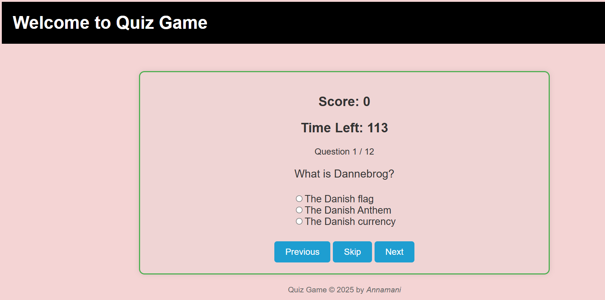

# Quiz Game

# About the Project

Quiz Game is a simple interactive browser game built with HTML, CSS, and JavaScript that lets users test their knowledge by answering questions. The game starts with a welcome screen and reveals the quiz questions only after clicking the Start Quiz button. The interface updates dynamically to show scores and time left during play.

# Features

- Start button triggers quiz display
- Interactive question navigation
- Score tracking for correct answers
- Time left indicator to add urgency
- Simple, beginner‑friendly game logic

## Technologies Used

HTML5, CSS3, JavaScript

## Project Purpose

This project was created to practice JavaScript fundamentals such as DOM manipulation, event handling, and logic control, while also reinforcing skills in web layout and responsive design. It serves as a hands‑on learning project demonstrating practical front‑end interactive behaviour.

## Live Demo

https://annamani.github.io/Project--Quiz-Game/

## Project Screenshot

